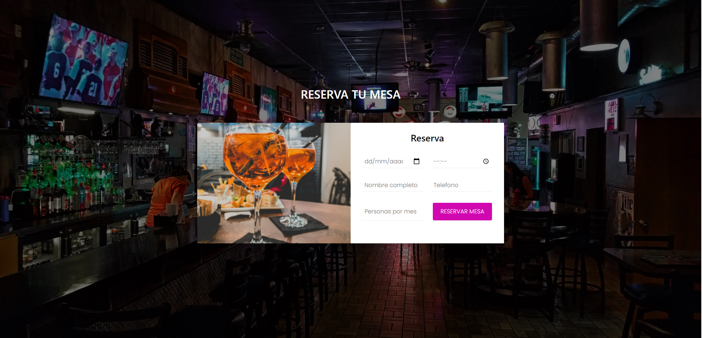
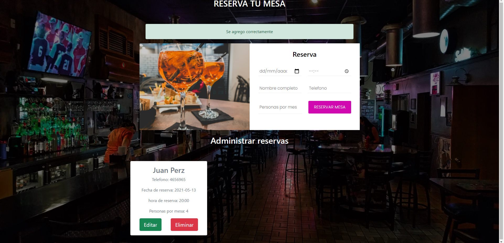
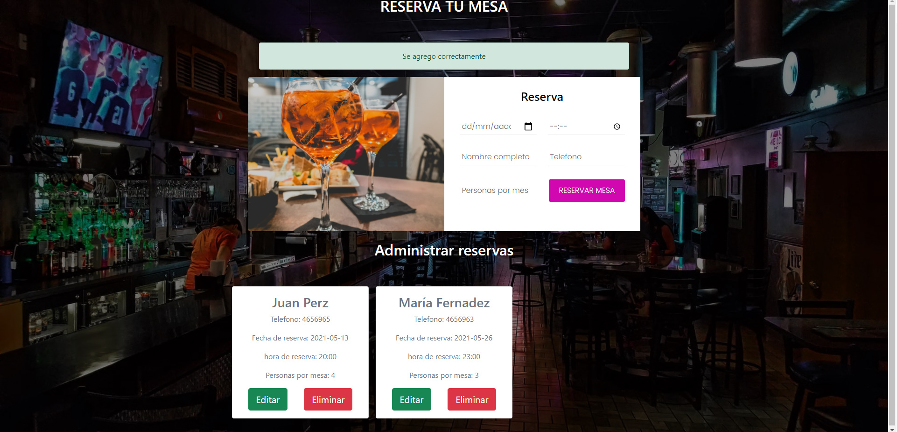
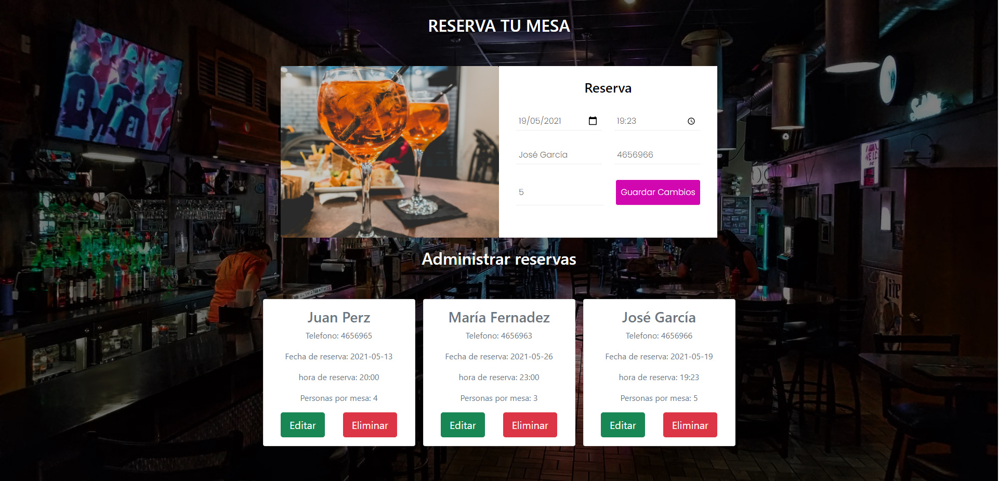
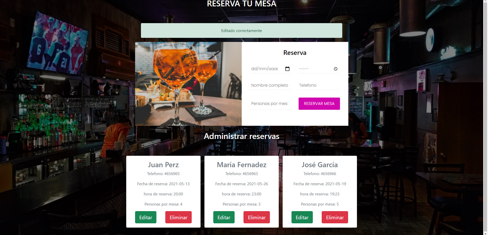
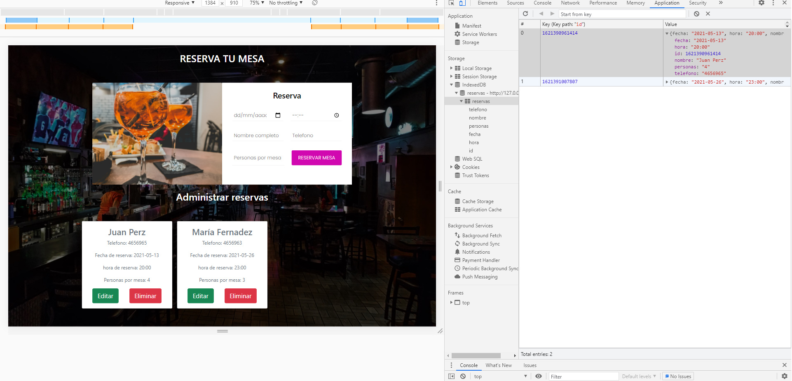

# gestion-reservas-restaurante-javascript

Gestión de reservas mesas de restaurante hecho en javascript usando indexeddb como base de datos

https://diegodelias.github.io/gestion-reservas-restaurante-javascript/

